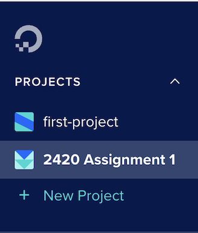
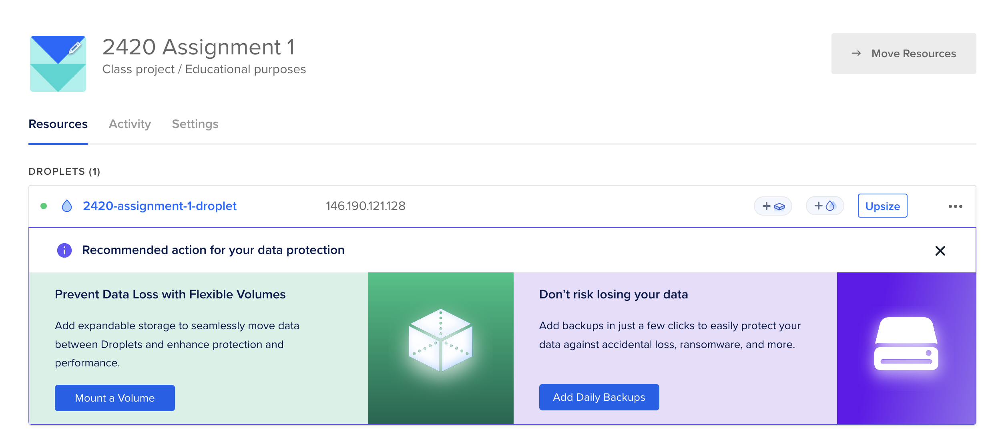

# ACIT 2420 Assignment 1 

Name: Qiyu (Ivy) Chen  

StudentID: A01338328

## Learning Objectives:

 By completing this tutorial, you will learn: 

- Creating and managing a remote server with DigitalOcean

- Using the web console or the command line (`doctl`) to create and manage a remote server.

- Understand and use cloud-init to configure DigitalOcean Droplets.

- Using SSH to connect to a remote server and manage it securely.

- Generating and managing SSH keys for authentication.

- Applying best practices for security and access control in cloud environments.

## Prerequisites

- You have a DigitalOcean account.

- You have a Basic knowledge of Linux.

- Yoy have download the appropriate [Arch Linux](https://gitlab.archlinux.org/archlinux/arch-boxes/-/packages/)  image.  You want the most recent "cloudimg". The ".qcow2" like in the image below, the date may be different. Download the most recent image.  


## Table of Contents

1. Creating an SSH key on your Local Machine

2. Adding SSH Key to DigitalOcean

3. Creating a Project and Droplet in DigitalOcean

4. Connecting to Your Droplet via SSH

5. Installing `doctl` Command-line Tool

6. Creating Cloud-Init File

7. Creating a Droplet Using `doctl` with the Cloud-Init File


## 1. Creating an SSH key pair on your Local Machine

### What is SSH?

- The Secure Shell (SSH) protocol is a method for securely sending commands to a computer over an unsecured network. SSH uses cryptography to authenticate and encrypt connections between devices.

- SSH also allows for tunneling, or port forwarding, which is when data packets are able to cross networks that they would not otherwise be able to cross. SSH is often used for controlling servers remotely, for managing infrastructure, and for transferring files.

### Why use SSH?

- SSH offers enhanced security through public key cryptography, which protects against unauthorized access and is more resistant to brute force attacks. It eliminates the risk of password interception during login, as SSH keys are not transmitted over the network. 
 
- SSH allows for convenient logins without needing to enter a password each time and provides better access control, enabling easy management and revocation of user access. 

1. To create a SSH key pair on your local machine，run the following command on your terminal:
```
ssh-keygen -t ed25519 -f ~/.ssh/2420assignment1 -C "your_email@example.com"
```

`t ed25519`: Specifies the type of key to create (ed25519 is recommended for security).

`f ~/.ssh/2420assignment1`: Specifies the file in which to save the private key. The public key will be saved with the same name but with a .pub extension.

`C "your_email@example.com"`: Adds a label to your key, typically your email address. 


3. Follow the prompts to generate your key pair. You can optionally set a passphrase. If you choose to set a passphrase, please do remember it.

4. After creating the SSH key, you can check if your key was created successfully by listing contents of the .ssh directory:
```
ls ~/.ssh
```
Output will look like this:  


You should see **2420assign1** (the private key) and **2420assign1.pub** (the public key) listed.

## 2. Adding SSH Key to DigitalOcean

After creating your SSH key pair, the next step is to add the public key to your DigitalOcean account. This allows you to securely connect to your droplets without needing to enter a password.

1. On your terminal, run the following command to directly copy your public key:
```
pbcopy < ~/.ssh/2420assign1.pub
```
2. Once copied your key, log in to your [DigitalOcean](https://www.digitalocean.com/) account. 

3. In the DigitalOcean dashboard, click on the **Settings** option in the left sidebar.

4. Select **Security** tab at the top.

5. Look for the **Add SSH Key** button and click it.

6. Paste your copied public key in the provided text box. In the **Name your key** field, give a recognizable name for your key. 

7. Click **Add SSH key** button to save your public key to your DigitalOcean account.

8. After adding the key, you should see it listed in the SSH Keys section. This confirms that your SSH key is now associated with your account and ready to use for connecting to your droplets.

## 3. Creating a Project and Droplet in DigitalOcean

In this step, you will create a project in DigitalOcean to organize your resources. You will also create a droplet, which is a virtual private server that will run your applications.

To create project: 
1. In the DigitalOcean dashboard, click on **+ New Project** located on the left side bar. 

2. In the **Project Name** field, enter a name for your project.
    - You can optionally add a description to help you remember what this project is about.

3. Click **Create Project** to save your new project.  

4. You should see your created project appear on the left side bar under **Projects**.  



To created a droplet:

1. From your project dashboard, click the **Create** button and select **Droplets** in the dropdown menu. 

2. In the **Choose Region** section, select a region that is geographically closest to you.

3. Under the **Choose an image** section, select **Custom images**, click **Add image** and upload the Arch Linux that you have previously downloaded. 

4. In the **Choose a plan** section, select the plan that suits your needs. 

5. Under the **Authentication** section, choose the **SSH Keys** option, and select the SSH key you added earlier from the list.

6. You can optionally choose additional settings like enabling backups, adding block based on your needs. 

7. Click the **Create Droplet** button at the bottom when you’re satisfied with your settings. 

8. You can view your droplet under **Resource** tab in your project homepage.  



## 4. Connect to Your Droplet via SSH

After you have created a droplet you can connect to it via SSH by running the following command: 
```
ssh -i .ssh/2420assign1 arch@your-droplets-ip-address
```
Replace **your-droplets-ip-address** with the actual ip address that you just created from step 3.

Output will look like this:


## 5. Installing `doctl` Command-line Tool

### What is `doctl`

- `doctl` is the official DigitalOcean command line interface (CLI). It allows you to interact with the DigitalOcean API via the command line. 

### Why Install `doctl`
- With doctl, you can create, configure, and manage DigitalOcean resources like Droplets, Kubernetes clusters, firewalls, load balancers, database clusters, domains, and more. 

1. Before installing doctl, make sure you have successfully connected to your Arch Linux droplet using your private key from Step 4.

2. Update the system package database and upgrade all the installed packages:
```
sudo pacman -Syu
```
3. Install `doctl` from the Arch User Repository (AUR) using the `yay` package manager.

- Installs all the necessary tools required to build and install AUR packages:
```
sudo pacman -S --needed base-devel git
```
Output will look like this:


- Clone the `yay` AUR Repository to downloads the source code of the yay package to your local system:
```
git clone https://aur.archlinux.org/yay.git
```
- Navigate to the `yay` Directory:
```
cd yay
```
- Build and Install yay:
```
makepkg -si
```
Output will look like this:


- Once you have `yay` installed, you can use it to install the doctl package from the AUR:
```
yay -S doctl
```
Output will look like this:


You may wonder why we are installing `doctl` using AUR and `yay`?

- Since doctl is not included in the official Arch Linux repositories, we need to use the AUR to install it. AUR helpers like yay make it easier to install and manage these packages, so you don't have to manually download and compile them.

4. Create an API token
- Create a [DigitalOcean API token](https://docs.digitalocean.com/reference/api/create-personal-access-token/) for your account with read and write access from the Applications & API page in the control panel. The token string is only displayed once, so save it in a safe place


5. Initialize doctl with the API Token by running the following command:
```
doctl auth init 
```
You will be prompted to enter your API token. Paste the token you copied earlier into the terminal.


6. To confirm that you have successfully authorized doctl, review your account details by running:
```
doctl account get
```
If successful, the output looks like:


## 6. Creating Cloud-Init File

### What is cloud-init?
- Cloud-init is a widely used tool for initializing cloud instances across various platforms. It automatically configures systems during the first boot by detecting the cloud environment and setting up essential aspects such as networking, storage, SSH keys, and packages.

### Why use Cloud-init?
- Cloud-init allows us to set up a server with initial configurations quickly. For instance, after creating and connecting to servers, we often need to run a few commands to update and install packages. While this will not take long time for one server, configuring 10 or 100 servers can be time-consuming.
- The easiest way to apply server configurations with cloud-init is through a config file, which is simply a YAML file. YAML is a human-friendly data serialization language for all programming languages.This allows for automated and consistent setup across multiple servers, saving time and reducing manual effort.

1. Before creating a cloud-init file, install a text editor like Vim or Nano.  

- To install nano:
```
sudo pacman -S nano
```
- To install vim:
```
sudo pacman -S vim
```
Now you can create a yaml file by running:
```
vim cloud-init.yaml
```
Note: This guide will use vim for demonstration.

2. In the cloud-init.yaml file, you will define the settings you want for your droplet. Simply copy and paste the following example into your cloud-init configuration file and make changes as needed. Press `i` on your keyboard to start typing.

```
#cloud-config
users:
  - name: user-name     #change to your desired name
    primary_group: group-name    #The primary group for the user
    groups: wheel     #Additional groups, granting sudo privileges
    shell: /bin/bash
    sudo: ['ALL=(ALL) NOPASSWD:ALL']     #Default shell for the user
    ssh-authorized-keys:
      - ssh-ed25519 ...    #Replace with your actual SSH public key

packages:
  - ripgrep
  - rsync
  - neovim
  - fd
  - less
  - man-db
  - bash-completion
  - tmux

disable_root: true     #Disable root login via SSH for enhanced security
```

For example:


3. After you finish editing, press `Esc` to enter command mode.
Type `:wq` (stands for write and quit) and then press Enter. This will save the file and exit the editor.

Now that your cloud-init.yaml file is saved and properly formatted, you can proceed with creating a Droplet using this configuration.

## 7. Creating a Droplet Using doctl with the cloud-init File

With your cloud-init configuration file ready, you can use it to create a new DigitalOcean Droplet. This will automate the initial setup, such as creating a user, installing packages, and configuring security settings.

Reminder: Before creating a droplet, make sure you have the following set up: 

- You have doctl installed and configured on your local machine (covered in Step 5).
- You have a cloud-init YAML file (cloud-init.yaml) ready with your desired configuration (covered in Step 6).
- You have a DigitalOcean API token added and authenticated with doctl.

1. To create a droplet,run the following command:
```
doctl compute droplet create your-droplet-name \
  --size s-1vcpu-1gb \
  --image arch-linux \
  --region nyc1 \
  --ssh-keys your-ssh-key-id \
  --user-data cloud-init.yml
```
`your-droplet-name`: Replace with your desired droplet name.  
`size`: Choose the droplet size (e.g., s-1vcpu-1gb).  
`image`: Image ID for the Arch Linux image.  
`region`: Specify the region for the droplet (e.g., nyc1).  
`ssh-keys`: Provide the SSH key ID.  
`user-data`: Point to your cloud-init configuration file (cloud-init.yml).

- To locate your image ID, run the following command:
    ```
    doctl compute image list-user
    ```
    This will show a table of all custom images associated with your account. Look for the column labeled ID and find the corresponding value for your Arch Linux image.

- To locate your SSH key ID, run the following command:
```
doctl compute ssh-key list
```
For example:


2. Verify the Droplet Creation

You can use the following command to list all your droplets and verify that if the new one has been created:
```
doctl compute droplet list
```

Output will look like this:


You can see that our new droplet **linux-droplet** has been created successfully.


3. Connecting to Your Droplet

Once the droplet is created and active, you can connect to it using SSH with the following command:
```
ssh -i .ssh/2420assign1 arch@your-droplets-ip-address
```
- Replace **your-droplets-ip-address** with the public IP address of your new droplet.
- Make sure to type `exit` and press `enter` to exit your previous SSH connect. 

Output will look like this:


Congratulations! You have successfully created a new DigitalOcean droplet using the doctl command-line tool and your cloud-init configuration. 

## Resources
[What is SSH?](https://www.cloudflare.com/learning/access-management/what-is-ssh/)

[doctl Command Line Interface (CLI)](https://docs.digitalocean.com/reference/doctl/)  

[Cloud-init documentation](https://docs.cloud-init.io/en/latest/index.html)


